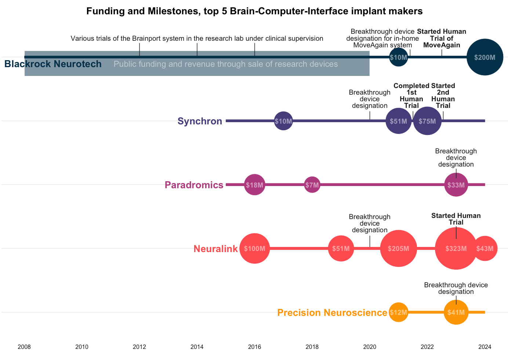

*A group of 5 implantable brain computer interface (BCI) startups, including Musk’s Neuralink, are starting to pull in hundreds of millions of venture capital dollars. While Neuralink has attracted the most funding by far, it’s not the furthest ahead on human trials or FDA milestones.*

The neurotechnology giant Blackrock’s [$200 million fundraise from Tether](https://www.forbes.com/sites/naveenrao/2024/04/30/what-200-million-in-crypto-cash-means-for-blackrock-neurotech/) in April 2024 marked a turning point in the way that brain-computer interfaces are funded.  BCI research has been [driven largely by DARPA](https://www.from-the-interface.com/DARPA-funding-BCI-research/), but venture capitalists are now starting to invest bigger sums into a field that will likely take decades to pay off. At the same time, the United States Congress [cut the budget for NIH’s BRAIN initiative](https://braininitiative.nih.gov/funding/understanding-brain-initiative-budget), indicating that more Neuroscience and neurotechnology research will need to be privately funded moving forward.

## Funding

[Neuralink](https://neuralink.com/) has always been privately funded with a total of $680 million, but most BCI companies have benefited from government funding through various DARPA or NIH grants. Musk is credited with bringing attention and funding to the field and raising the funding numbers by an order of magnitude, to the benefit of other manufacturers, who have made more progress with human studies. 

There are 3 other major players in invasive BCI. [Paradromics](https://www.paradromics.com/), founded around the same time as Neuralink with $88 million raised, has not started human studies despite an FDA breakthrough device designation. [Synchron](https://synchron.com/), originating in Australia with $145 million funding to date, has the most patients in clinical trials after Blackrock. The newest entrant, [Precision Neuroscience](https://precisionneuro.io/), makes a device that lies on the surface of the brain rather than within it and has already been implanted in humans for safety testing and data gathering.

## FDA and human studies milestones

Most manufacturers follow the following sequence: they petition FDA for [breakthrough device designation](https://www.fda.gov/medical-devices/how-study-and-market-your-device/breakthrough-devices-program). This optional step puts them in a program that speeds up communication with the agency, but it doesn't mean they're approved to start clinical trials or for their devices. When they're ready to start human trials, usually after animal testing, they apply for an investigative device exemption (IDE) from the FDA. This means they're authorized to begin clinical trials in humans. Initial trials must be small, primarily aimed at establishing safety over both the short and long term. These trials can take years to complete, with Neuralink's PRIME study spanning 6 years. Manufacturers often use these safety trials to demonstrate efficacy or some level of functionality, such as controlling a keyboard or mouse, or to gather data. 
Finally, most clinical trials are registered at clinicaltrials.gov for transparency (see Synchron’s [COMMAND trial](https://clinicaltrials.gov/study/NCT05035823) for example) so that the public can track the goals of the trial, the milestones, and progress — it also obliges them to report outcomes. Neuralink notably hasn’t registered their clinical trial. 

<small class="caption">Chart showing funding, FDA milestoens and human clinical trials for the top 5 implanted BCI makers in 2024. Neuralink has raised the most funding but isn’t the furthest ahead on human clinical trials.</small>

## Blackrock
Blackrock’s 128-electrode Utah Array has been around since well before most people heard of brain-computer interfaces. While the other companies have one primary device that they are taking through the regulatory steps, Blackrock has taken a more [pipeline approach](https://www.forbes.com/sites/naveenrao/2024/04/30/what-200-million-in-crypto-cash-means-for-blackrock-neurotech/). They have produced the ‘[majority of brain implants that have been in humans](https://blackrockneurotech.com/)’, and their BCIs have been through a variety of clinical trials at research labs around the US demonstrating control of motor functions through typing, moving prosthetic limbs, and translating sensations back from a prosthetic to the brain. 

The Utah array was first implanted in humans in 2004, but the company Blackrock was founded in 2008. Until recently their BCI’s were designed for use in the lab as part of a research study, but in 2022 Blackrock reported a partnership to [expand these clinical trials to a portable in-home BCI system ‘Moveagain’](https://www.rnel.pitt.edu/clinical-trials/individuals-tetraplegia/sensorimotor-microelectrode-brain-machine-interface), which received breakthrough device designation in 2021.  In 2022, Blackrock also announced ‘Neuralace’, a 10,000+ channel array on a flexible chip, that will become available to the neuroscience research community in 2024. 

Blackrock has received [significant public funding](https://www.forbes.com/sites/naveenrao/2024/04/30/what-200-million-in-crypto-cash-means-for-blackrock-neurotech/), both directly through grants, and indirectly through funding for research trials at academic hospital systems across the US. Their revenue for most of the company’s life has been from an array of [research devices and systems](https://blackrockneurotech.com/products/) for scientists to study mice, primates, and human diseases like epilepsy. After a smaller ($10M) round of private funding in 202, [this new funding round](https://www.reuters.com/technology/crypto-company-tether-invests-200-mln-brain-chip-maker-blackrock-neurotech-2024-04-29/) from Tether will make the stablecoin firm a majority shareholder in Blackrock (with close to 60% shares owned). 

## Neuralink
Neuralink’s story is well-chronicled. Founded by Elon Musk and a team of seven scientists and engineers in 2016, the first $100M came from Musk. Over the years the BCI firm has raised a total of $680 over 5 rounds from private investors, with the last round being $323 million in August 2023. Neuralink’s valuation is said to be in the billions, and the company has received no public funding. 

Neuralink’s premise is its N1 Implant that records neural activity through 1024 electrodes distributed across thin and flexible 64 threads, and the use of a surgical robot to do the implantation because these threads are too fine to be placed by human surgeons. Neuralink secured breakthrough device designation for its brain implant in July 2020 and the company demonstrated a [macaque playing pong with its brain in 2021](https://www.youtube.com/watch?v=2rXrGH52aoM). The company received an IDE (or permission to start human trials) from FDA  in May 2023, after a rejection in 2022. Their [PRIME study](https://neuralink.com/pdfs/PRIME-Study-Brochure.pdf) started recruiting September 2023 and will take 6 years to complete. 
Neuralink did not register the study at clinicaltrials.gov, but [released a video](https://twitter.com/neuralink/status/1770563939413496146) in March 2024, showing a patient using the brain implant to play chess, followed by a [100-day update in May](https://neuralink.com/blog/prime-study-progress-update-user-experience/). 

## Paradromics

Founded in 2015, Paradromics has raised a total of $88.7M in private funding over several rounds, in addition to approximately $18M in research funding from the United States Defense Advanced Research Projects Agency (DARPA).

Their implant  is a ‘high data-rate brain computer interface’ designed for long-term daily use. Paradromics received breakthrough device designation for its ​​Connexus DDI device in May 2023, and the team aims to launch its first human clinical trial in 2024.

## Synchron

Synchron was also founded in 2016 to acquire a spinoff from the University of Melbourne. The company has raised a total of $145 million in funding over 5 rounds, with their latest $75 million Series C round in December 2022. Synchron is backed by some well-known names including Bill Gates, Jeff Bezos, and Khosla Ventures. 

Unlike the other BCIs, Synchron’s device - the Stentrode -  is intravascular, meaning that it sits inside a large blood vessel rather than directly in contact with the brain. This means that it is safer to implant, but also perhaps limited in its possible location and consequently in its function. 
The Synchron Switch™ BCI (a platform that builds on the Stentrode device) received FDA Breakthrough Device Designation in August 2020. 

Synchron’s first human study with 4 patients in Australia completed in 2022. The technology was not only safe, but also [allowed patients to do hands-free texting, emailing, online banking and shopping, and communicating care needs using their thoughts](https://pubmed.ncbi.nlm.nih.gov/36622685/). Following this, they started the [COMMAND trial](https://clinicaltrials.gov/study/NCT05035823) in 2022 at three US clinical sites. The primary goal is to establish safety, but the trial has also been designed to evaluate how the BCI may enable the use of patients’ thoughts to control digital devices for daily tasks.

## Precision Neuroscience
The newest addition to this list of BCI makers is [Precision Neuroscience](https://precisionneuro.io/). Founded in 2021, three members of the Precision crew are ex-Neuralink, including Ben Rapoport, who was the surgeon on Neuralink’s founding team. The startup has raised $53M in funding -  $12M in 2021 followed by $41M in January 2023. 

Their device is a thin-film microelectrode that sits on top of the brain rather than within it - a flexible, modular and bidirectional micro-ECoG, that is coupled with a minimally invasive “cranial micro-slit” technique for insertion.

Precision Neuroscience received a breakthrough device designation in 2023. Later that year, they also did a pilot study recording neural signals in patients undergoing neurosurgery. Their device was only temporarily positioned over the brain - a proof of concept that recordings were possible and data could be gathered. The company has not yet received an IDE, performed clinical trials, or demonstrated safety or efficacy. 

*Many of these companies, notably Neuralink and now Blackrock, want to one day expand the use of these implanted devices beyond cursor control and motor control to vision and to higher-bandwidth communication. Given that they are only now performing their first safety trials with single-digit patient numbers — this could be decades away.*