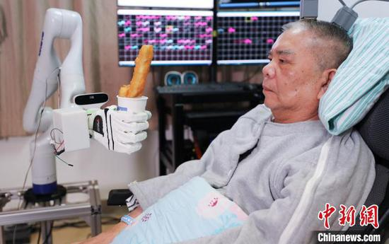
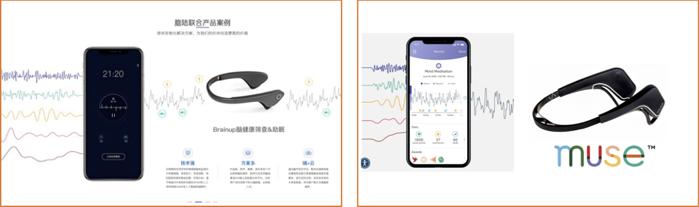
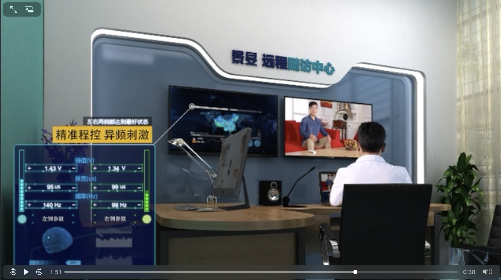

*Chinese brain-computer interface research is about a decade behind the US or Europe but is likely to catch up quickly as the government pours funding into the China Brain Project. Local manufacturers of implants for Deep Brain Stimulation (DBS) and Spinal Cord Stimulation (SCS) are giving established global players a run for their money. Neurotechnology startup activity is limited.*

Global awareness of China's progress in BCI (or any technology) is much
lower than the average Chinese person's awareness of Western advances.
Chinese media extensively covers news about global BCI events or
milestones. Research papers are accessible (and widely accessed) by
Chinese researchers, who are part of the international research
community. Although Chinese work is starting to be more accessible to a
global audience, many Chinese-language publications or media reports are
never translated. This post is probably similarly incomplete and perhaps
biased, as it is compiled almost entirely from English-language media
reports and papers.

Globally developed neural interface devices (say deep brain stimulation
devices or cochlear implants) are also widely available in China. China
is a critical, fast-growing growing market for these device makers. In
addition to these, Chinese physicians have access to locally developed
implants and are starting to use them to treat a broad set of illnesses.
For example, 61.8% of China's clinical trials of DBS involve non-motor
indications (such as neuropsychiatric conditions and opioid addiction),
unlike in the West where the primary indications for DBS are Parkinson's
disease and essential tremor.

The most convenient way to look at neurotechnology initiatives in China
is to look separately at government intent, university research,
startups, and established medical device manufacturers — although all
these entities are linked.

The Chinese Government and the Brain Project
============================================

Brain-computer interfaces, Neurotechnology, and Neuroscience research are
all focus areas of the '[China Brain
Project](https://www.cell.com/neuron/pdf/S0896-6273(16)30800-5.pdf)',
announced in 2016 as part of the 13^th^ five-year plan. The project's
ambition is to lead the world in neuroscience, especially applied
neuroscience for brain disease within the next few decades. It is
motivated by the realization that by 2030 half of the world's people
suffering from neurodegenerative disease will be living in China.

<small class="caption">Screenshot from the <a href="https://www.youtube.com/watch?v=gV0f5mPpnDg"> CGTN video</a> about the China Brain Project</small>

[This video](https://www.youtube.com/watch?v=gV0f5mPpnDg) is a thorough
explainer of the Project's goals and the 'One Body Two Wings' vision for
brain research. Produced by the state-owned China Global Television
Network (CGTN), it allows a glimpse of the brain project as the
government intends to portray it, giving a glimpse into the leaders'
goals and their perceptions of China's strengths and weaknesses for
neurotechnology research. The directors of the project see China as
well-positioned to study neurological and neuropsychiatric
disease given their large population and emphasize the need for better
characterization of these illnesses in the Chinese population. In
addition to neurological disease research, they also have an eye on
medical devices and neuromodulation. They concede that the US will
continue to lead the world in basic neuroscience research for many years
to come.

A key feature of the Brain Project is the International Primate Research
Center in Shanghai, a facility that the leaders of the project hope will
spur international collaboration. They plan to use the facility to
conduct functional research and to develop new primate models of
neurological disease.

Universities and Research Institutes involved in Neurotechnology and BCI
========================================================================

Money invested by the government goes to dedicated brain research
institutes or universities across the country. These centers recruit
research groups and investigators, often with a focus on attracting
talented Chinese(largely) individuals that have been trained overseas.
Some of the top centers in China for BCI research are the Tsinghua
University, Tianjin University, Zhejiang University, the newly
established Institute of Neuroscience in Shanghai, and the Chinese
Institute for brain research, Beijing.

**Zhejiang University**: Developed China's first
brain-computer interface implanted in a human in 2020, [announcing a
successful
implant](http://www.ecns.cn/cns-wire/2020-01-17/detail-ifzsuknk2867059.shtml)
in a paralyzed individual that allowed him to manipulate robotic
arms with his thoughts to shake hands, carry drinks, eat fried dough
sticks and play Mahjong.

<small class="caption">Image from <a href="http://www.ecns.cn/cns-wire/2020-01-17/detail-ifzsuknk2867059.shtml"> China News Service</a></small>

**Chinese Institute for Brain Research, Beijing**: [Launched
2018](https://www.nature.com/articles/d41586-018-04122-3), the Beijing Municipal government is funding the institute with with USD 29MM in the first year, with a future USD 65MM annual budget.

**Institute for Neuroscience, Shanghai**: Part of a
Neuroscience research science park being built in Shanghai and funded by
the [Shanghai Municipal
government](https://www.nature.com/articles/d42473-020-00026-x), one of
the highlights of the institute will be the International Primate
Research Center, to house as many as 6000 non-human primates. Positioned
as a world leader, the center has already [attracted international
scientists](https://science.sciencemag.org/content/367/6477/496.2).

**Tsinghua University**: The National Engineering Laboratory
for Neuromodulation, Tsinghua University was responsible for the first
locally developed DBS device, now commercialized by PINS Medical,
Beijing, and used widely within China.

**Tianjin university**: Source of innovations such as a
'[Brain
Talker'](https://futurism.com/the-byte/brain-computer-interfaces-brain-talker)
computer chip designed for BCI applications, an [exoskeleton
rehabilitation hand
robot](https://dl.acm.org/doi/abs/10.1109/ICMA.2016.7558720), and a
'[Mind-Typing
cap'](http://www.xinhuanet.com/2019-12/23/c_1125377135.htm) that allows
the user to brain-type 69 Chinese characters per minute, exceeding the
speed of using touch screen mobile phones to type.

Clearly, in a country as large as China, there are many more than these
5 top-tier universities working on neurotechnology, including in areas
such as materials science, electronics, and neuromorphic computing.

Startups
========

Startup activity in brain-computer interfaces or neurotechnology appears limited, with sporadic funding announcements, and not
many demos or products available in the English-language media. The
startup [Neuramatrix](http://www.neuramatrix.com.cn/) incubated by
Tsinghua university — generated a bit of a ripple earlier this year
when they made a [funding
announcement](https://cntechpost.com/2021/03/15/chinese-brain-computer-interface-platform-neuramatrix-raises-multi-million-dollars-in-pre-a-round-of-funding/).
Founded in 2019, the company employs about 50 people, mainly R&D and
product engineers, and claims that their invasive BCI chip rivals
Neuralink.

<small class="caption">Screenshots from the website of a company named 'Naolu' showing their <a href="http://www.naolubrain.com/page/en/index.html"> 'Brainup' product</a> (left) whose marketing graphics and headband appear to be 'inspired' by <a href="https://choosemuse.com"> Muse</a> (right).</small>

This [list of Chinese BCI
startups](https://tracxn.com/explore/Brain-Computer-Interface-Startups-in-China)
is largely comprised of developers of non-invasive headband-type devices for meditation,
biofeedback, and other consumer applications.

Medical Devices, Implants and Neuromodulation
=============================================

While university research and startups are still nascent, Chinese
manufacturers of DBS and other neuromodulation devices have advanced
quite far in the last decade. DBS in China is used not only for
Parkinson's disease but also for non-motor diseases. [Ruijin Hospital in
Shanghai](https://www.abc.net.au/news/2019-05-08/china-trials-brain-implants-to-treat-drug-addiction/11090936),
for example, runs a DBS research center for addiction, Tourette
syndrome, depression, anorexia, and other neuropsychiatric conditions.

The Chinese manufacturers [PINS
Medical](http://www.pinsmedical.com/html/en/) and
[Sceneray](http://www.sceneray.com/en/product) offer DBS systems
on par with, if not more advanced than their Western equivalents.
Both companies' devices are approved for use by the Chinese FDA, have
the European CE mark and have been introduced to markets like Pakistan,
Bangladesh, and Indonesia. Both companies offer advanced remote wireless
control of the implants, with well-established methods for remote
programming and calibration of the devices and monitoring battery levels
through telemedicine by clinicians that may be far away — a feature
that has been rendered invaluable [during the COVID-19 pandemic](https://link.springer.com/article/10.1007/s00415-020-10273-z).
Additionally, both companies are expanding to invasive and non-invasive
vagal nerve stimulators and spinal cord stimulation devices.

<small class="caption">Screenshot from <a href="http://www.ecns.cn/cns-wire/2020-01-17/detail-ifzsuknk2867059.shtml">Sceneray's video</a> showing their remote DBS device reprogramming feature</small>

China is also the [fastest-growing market for cochlear
implants](https://www.ft.com/content/6e49f756-5f01-11e8-9334-2218e7146b04),
with the Hangzhou-based company Nurotron [gaining market
share](https://www.ft.com/content/6e49f756-5f01-11e8-9334-2218e7146b04)
from Australia's Cochlear, Swiss-based Sonova, and Austria's MED-EL not
only in China but also in other emerging markets.

It is yet to be seen how much original neurotechnology research will
come out of China, but it is already clear that the country will be key
to the commoditization of these interfaces. In turn, this will facilitate
access to this technology globally and make them more affordable for
