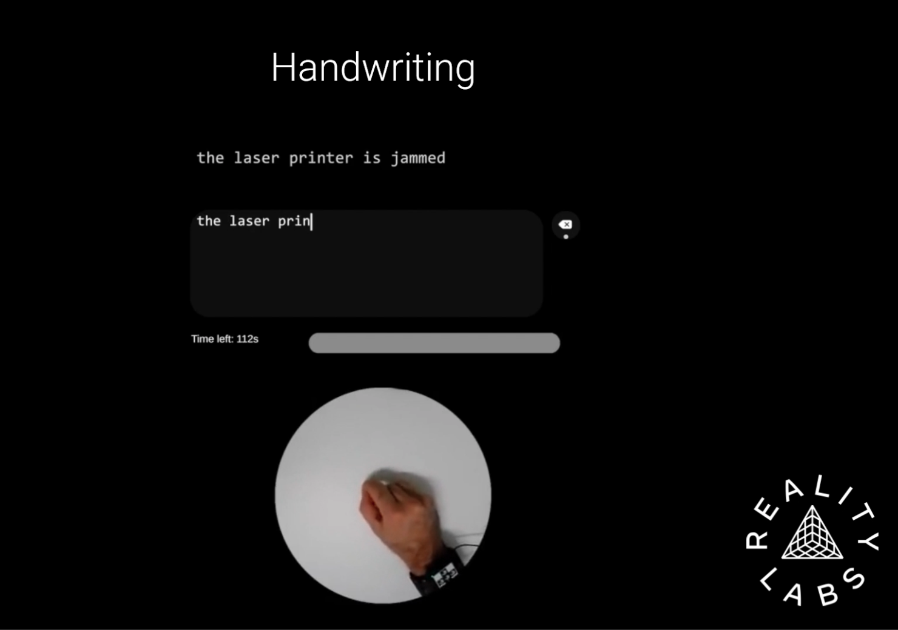
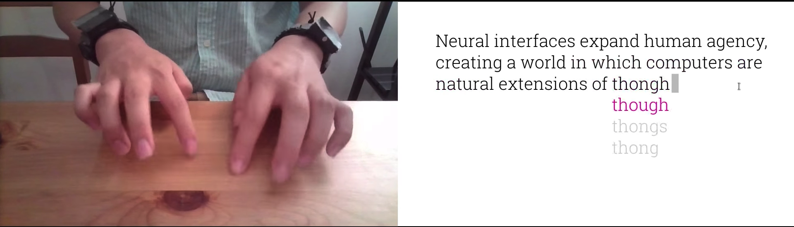

*Ctrl Labs within Meta’s Reality Labs division released a paper about their incredible progress on a generalizable wristband-based generalizable neural interface. The choice of a handwriting demo task over the previously teased typing task is curious, and unless there is more coming soon, there is still a lot of work to be done before they can launch it as a product.*

Soon after Mark Zuckerberg alluded to a neural interface that was was ‘... actually kind of close to…a product in the, in the next few years…’ on the [Morning Brew](https://www.youtube.com/watch?v=xQqsvRHjas4) show, the Ctrl Labs team at Meta’s Reality Labs released a research paper about their sEMG wristband. 

[The paper](https://www.biorxiv.org/content/10.1101/2024.02.23.581779v1.full.pdf) describes how they used data from thousands of participants to train models that allow their wristband prototype (or research device) to work out of the box for new users — a first in the neural interface field.  Their research is robust and reported in detail, describing how the team
* Combined  their multielectrode sEMG bracelet hardware with a scalable data collection infrastructure
* Used this setup to this to collect data from 1000s of participants for wrist movements, gestures like thumb and finger taps, pinches and swipes, and handwriting tasks
* Developed models that achieved close to 90% classification accuracy for held-out participants on gesture detection and handwritten character recognition

<small class="caption">Still from a <a href="https://www.biorxiv.org/content/10.1101/2024.02.23.581779v1.supplementary-material"> supplementary video</a> uploaded with the paper</small>

They showed that:
* Training on a large enough dataset allows you to build generalizable models for wrist sEMG (although the dataset itself isn't available).
* Model personalization further improves performance and reduces latency.

The 3-page list of contributors indicates how much effort has gone into this since Ctrl Labs' acquisition in 2019. The demonstration of a neural interface that works without calibration is certainly noteworthy for the BCI world. However, there is still a significant gap between this paper and some earlier demos and teasers. In particular, their choice of a handwriting task, which achieves at best less than half the speed of typing, raises more questions.

I'd love to understand why they didn't pick the typing task they had previously shown in a video. In the paper, the authors stress that their ground truth was approximate and relied on prompts and inferred timing. A typing task — perhaps with a touch keyboard — should have been able to provide them with a true ground truth that was more scalable. Typing would also provide much more open space for adaptive learning, envisioned in Meta’s [March 2021 post](https://about.fb.com/news/2021/03/inside-facebook-reality-labs-wrist-based-interaction-for-the-next-computing-platform/), “...imagine instead a virtual keyboard that learns and adapts to your unique typing style (typos and all) over time..“.

<small class="caption">Still from an <a href="https://about.fb.com/news/2021/03/inside-facebook-reality-labs-wrist-based-interaction-for-the-next-computing-platform/"> ealier video</a> with a virtual keyboard</small>

Other areas that Meta had discussed earlier, but this paper didn't touch on, were barely perceptible controls or the use of much subtler non-perceptible movements (accessible neuromotor information that isn't being utilized), and intention and co-adaptive learning, or using language models to correct human text. Meta has previously demonstrated and discussed these, with evidence that they have research devices and models capable of performing these tasks. Hopefully this is just a preview, and more is coming soon.