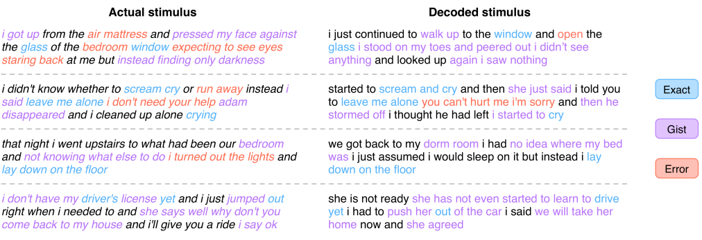
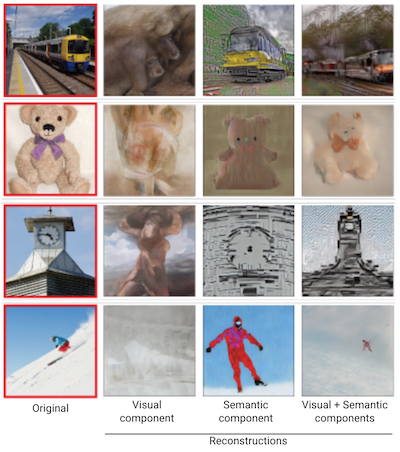

*This post compares two new research papers that use generative AI techniques 
to ‘read’ images and text from human brain activity patterns. The first paper 
generates sentences that subjects heard in podcasts, and the second reconstructs 
visuals that they were shown — both using only fMRI readings. Together, they 
show that generative AI techniques can compensate for some limitations of 
fMRI to capture not only the literal words or pixels perceived but also their 
semantic meanings.
*

While these papers were formally published just after generative AI entered 
the mainstream consciousness through image generation from text ([Stability AI](https://stability.ai/), 
[Midjourney](https://www.midjourney.com/), [DALL-E](https://openai.com/dall-e-2)), and large language models 
([ChatGPT](https://openai.com/blog/chatgpt)), both were conceived  in 2022 using older versions of 
these models. In many ways these papers are variations on the famous ‘[I can see what you see](https://www.nature.com/articles/nn0309-245)’ 
era work from 2009-2011, with the latent diffusion and large language models now doing the heavy lifting.

## Paper 1

In [Semantic reconstruction of continuous language from non-invasive brain recordings](https://www.nature.com/articles/s41593-023-01304-9), the researchers train an fMRI-to-paragraph generator for 3 participants, using fMRI data created while subjects listened to 16 hours of podcasts. Their decoder is able to capture the gist of the sentences at a level higher than chance, but the examples in the paper (image below) give the impression that the LLM is relying on its vast training corpora to to autocomplete a faint signal.

<small class="caption">Example output from the decoder on the test dataset</small>

## Paper 2

The authors of [Stable Diffusion with Brain activity](https://sites.google.com/corp/view/stablediffusion-with-brain/) use the open source [Stable Diffusion](https://github.com/CompVis/stable-diffusion) model to reconstruct images from the [Natural Scenes fMRI Dataset](https://naturalscenesdataset.org/). They trained models to map from fMRI signals corresponding to the visual and semantic regions of the brain to the image and text components of the latent diffusion models. The results are spectacular, showing that the latent diffusion model combines the two components to produce images that are similar to the original both in meaning and in appearance.

<small class="caption">Example of reconstructed images from a single subject</small>

|                                        | **High-resolution image reconstruction with latent diffusion models from human brain activity**                                                                                 | **Semantic reconstruction of continuous language from non-invasive brain recordings**                                                                                                                                                                                                                                                                                                                                                                         |
| -------------------------------------- | ------------------------------------------------------------------------------------------------------------------------------------------------------------------------------- | ------------------------------------------------------------------------------------------------------------------------------------------------------------------------------------------------------------------------------------------------------------------------------------------------------------------------------------------------------------------------------------------------------------------------------------------------------------- |
| Published                              | [CVPR 2023](https://openaccess.thecvf.com/content/CVPR2023/html/Takagi_High-Resolution_Image_Reconstruction_With_Latent_Diffusion_Models_From_Human_Brain_CVPR_2023_paper.html) | [BioRxiv](https://www.biorxiv.org/content/10.1101/2022.09.29.509744v1.full.pdf) Sep 2022, [Nature Neuroscience](https://www.nature.com/articles/s41593-023-01304-9.epdf?sharing_token=TxIl7w-LzveYxwD3Bra-HdRgN0jAjWel9jnR3ZoTv0NG3whxCLvPExlNSoYRnDSfIOgKVxuQpIpQTlvwbh56sqHnheubLg6SBcc6UcbQsOlow1nfuGXb3PNEL23ZAWnzuZ7-R0djBgGH8-ZqQhwGVIO9Qqyt76JOoiymgFtM74rj8so6Z9hK_9_jPC-vyeC-EstnL-hhenHP41nL-X1BIg%3D%3D&tracking_referrer=www.vice.com) March 2023 |
| Generative AI model                    | [Stable Diffusion](https://github.com/CompVis/stable-diffusion)                                                                                                                 | [Original GPT](https://cdn.openai.com/research-covers/language-unsupervised/language_understanding_paper.pdf)                                                                                                                                                                                                                                                                                                                                                 |
| Key contribution                       | Reconstruction of perceived  images from fMRI with much higher semantic and pixel-wise fidelity than previously possible.                                                       | First reconstruction of continuous language from fMRI. Prior work used a fixed vocabulary.                                                                                                                                                                                                                                                                                                                                                                    |
| Individual-specific algorithm training | Yes, all models were built on a per-subject basis                                                                                                                               | Yes, trained separate model for each participant                                                                                                                                                                                                                                                                                                                                                                                                              |
| Brain imaging modality                 | fMRI                                                                                                                                                                            | fMRI                                                                                                                                                                                                                                                                                                                                                                                                                                                          |
| Dataset description                    | Used the [Natural Scenes dataset](https://naturalscenesdataset.org/) of fMRI measurements of 8 healthy adults shown images from CoCo.                                           | fMRI recordings from 3 subjects while listening to listened to 16 hours of podcasts                                                                                                                                                                                                                                                                                                                                                                           |
| Dataset availability                   | Openly available through [Access Agreement](https://naturalscenesdataset.org/)                                                                                                  | Not openly available                                                                                                                                                                                                                                                                                                                                                                                                                                          |
| Code available                         | [Soon](https://sites.google.com/corp/view/stablediffusion-with-brain/)                                                                                                          | [Partly](https://github.com/HuthLab/semantic-decoding)                                                                                                                                                                                                                                                                                                                                                                                                        |

These recent papers bringing AI and neuroscience worlds closer together were only possible because the 2022 versions of generative AI models were open access (like the Natural scenes fMRI dataset). If we had better neural interfaces (higher bandwidth, more fidelity and better temporal resolution) the models could do a lot more.