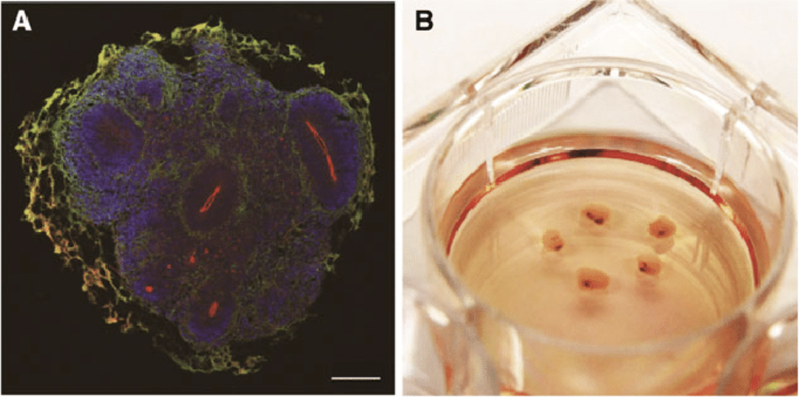

*From neurons in dishes to behaving insects to primates, how do we trade
off accessibility and iteration speed against clinical relevance? What
model is best suited to which research question?*

<small class="caption">Photo a micro-electrode array and a neural culture from <a href="http://www.its.caltech.edu/~daw/papers/06-PWD-preprint.pdf">Potter et al.</a></small>

For newcomers to BCI research, it might feel like no man's land between
Neuralink's implantables and Emotiv's (or openBCI's) wearables. But
there are many ways to contribute to BCI, or to learn about the field.

There's a lot that happens at the interface between the wet grey gloop
of neurons and the ever-finer wires that prod them listening for signals
to pass outwards. The number of components that have to be developed,
tested, and perfected before you can build a functional BCI is immense.

This is where model systems come in. The better we understand and
develop these components --- basic neurobiology, materials and
biocompatibility, imaging techniques, stimulation and recording methods,
and signal decoding --- the faster and safer the path to BCI.

Scientists have done fascinating work with two-dimensional cultures of
neurons. In one of the more well-known applications, a group trained a
cultured dish of rat neurons [to fly a
plane](https://www.seeker.com/brain-in-a-dish-flies-plane-1766088867.html)
in simulations of various weather conditions. Gimmicks aside, growing
rat or human neurons on multielectrode arrays provides a way to study
the activity of neural networks -- albeit artificial ones. A neuronal
culture is an elaborate and spontaneously active living neural network,
but it is not likely that its organization has any correlations with
real-life networks. The neuron culture technique has been standardized
down to [kits](http://www.brainbitsllc.com/), with open-source
[software](https://www.researchgate.net/publication/11289974_MEA-Tools_An_open_source_toolbox_for_the_analysis_of_multi-electrode_data_with_MATLAB)
to help analyze the recordings.

This paradigm even has direct commercial potential, with 'wetware'
startups like [Koniku](https://koniku.com/) using these little dishes of
lab-grown neural networks for odor detection for security, military, and
agricultural applications.

Neurons grown in 3 dimensions using 3D scaffolds or a gel matrix allow
even more surface area for recording. This is where these cultures start
to be called 'brain organoids', bringing to mind science fiction
scenarios. Every model system raises a new set of ethical questions, and
these 'brain organoids' come with a particularly [large
list](https://www.nature.com/articles/d41586-018-04813-x) of issues to
consider before you embark.

<small class="caption">Human midbrain organoids from <a href="https://onlinelibrary.wiley.com/doi/abs/10.1002/acn3.505">Sun et al. 2018</a></small>

Some techniques that are relevant to today's BCI have been developed in
the so-called 'lower animals', notable voltage-sensitive dyes that allow
imaging of neuronal activity. Nematodes (Caenorhabditis Elegans) are
1-mm-long worms whose nervous system is completely mapped out --
providing a system to study a rudimentary yet complete network of
neurons. The [Openworm](http://openworm.org/) project is an effort
towards creating a fully virtual nervous system. Leeches have also been
used for similar experiments, for their accessible, simple, and
well-mapped out nervous systems.

Insects models of neuronal stimulation are perhaps more captivating.
[Backyard brains](https://backyardbrains.com/) offer a [Roboroach
set](https://backyardbrains.com/products/roboroach) for
high-school-level science experiments. In research labs, simultaneous
multiple motor neuron activity has been studied in [tethered
cockroaches](https://www.ncbi.nlm.nih.gov/pmc/articles/PMC4161038/), but
it is unclear how much of this research can be translated to humans.
Other insects like bees are also been used to study the relationship
between behavior and neuronal activity, primarily odor.

<small class="caption">The <a href="https://backyardbrains.com/products/roboroach">RoboRoach Bundle</a> from Backyard Brains</small>

Rodent models are usually the first stop for testing invasive BCI
prototypes-- whether they are
[head-mounted](https://www.biorxiv.org/content/10.1101/703801v4)
recorders, or
[sono-optogenetics](https://science.sciencemag.org/content/369/6504/638)
stimulation systems. Systems that are too large for rodents, like
[vascular stent
electrodes](https://www.nature.com/articles/s41551-018-0321-z) are
typically tested in sheep.

Research in primates is pre-clinical. Primate studies are one step away
from human implantation, so implants have to be in near-final shape
before they reach this stage. Human BCI aside, many seminal
demonstrations of motor control, have been done in primates and much of
our understanding of the motor and sensory cortices come from [research
in
monkeys](https://en.wikipedia.org/wiki/Brain-computer_interface#Animal_BCI_research).

###Model systems relevant to BCI research
<table>
<thead>
<tr class="header">
<th class="narrow"><strong>Model System</strong></th>
<th class="wide"><strong>Applications</strong></th>
<th class="wider"><strong>Relevance to BCI research</strong></th>
<th class="wide"><strong>Limitations</strong></th>
</tr>
</thead>
<tbody>
<tr class="odd">
<td>Single-unit neuron recordings</td>
<td>Study of cell- and molecular-level neurobiological processes in concert with electrical activity.</td>
<td>Fundamental method of recording neuronal activity and form the basis for classic experiments underpinning the neuron doctrine.</td>
<td>Single-neuron recordings are a ‘method’ rather than a ‘model system’</td>
</tr>
<tr class="even">
<td>2D neural cell cultures</td>
<td>Study of neurons acting as a collective.</td>
<td>
Computational neuroscience starts to get interesting at this level

Testing for material biocompatibility, co-adaptation of new materials with neural tissue

Early R&amp;D on new stimulation/recording techniques like optogenetics
</td>
<td>
The organization of an in vitro networks is very different from real-life neural networks.

The effects of any perturbations, whether genetic, pharmaceutical or even electrical stimuli are not translatable
</td>
</tr>
<tr class="odd">
<td>3D cell culture</td>
<td>More intricate and longer lasting than 2D cultures, with more neural cell types in the mix</td>
<td>The 3D structure allows more complex versions of the studies done with 2D cultures as there is more than 1 plane/surface for recording</td>
<td>Start to capture popular imagination as ‘brain organoids’, even though there are few similarities to the real brain.</td>
</tr>
<tr class="even">
<td>Slices of brain tissue from animals or even humans (ex vivo)</td>
<td>Study of intact neural circuits. Each neuron in the circuit can be studied.</td>
<td>Most useful for studies of the hippocampus, retina or other areas with a known architecture, where many relevant cells circuit can be found in the slice</td>
<td>Only preserves connections along one plane. Important input connections may be lost, forming an incomplete picture</td>
</tr>
<tr class="odd">
<td>Invertebrates (Nematode worms, leeches, etc.)</td>
<td>Contribute to single-neuron studies or simple networks of a few well-characterized neurons operating in loops</td>
<td>
Early R&amp;D on new stimulation/recording techniques like optogenetics

Have been instrumental in the development of techniques such as voltage-sensitive dyes
</td>
<td>Nervous system is highly accessible, but neuronal behavior is significantly different from humans, research is rarely translatable</td>
</tr>
<tr class="even">
<td>Insects (Arthropods)</td>
<td>Most complex models that are available to DIY-ers, or science labs without institutional oversight. Allow studies in ‘behaving’ organisms</td>
<td>Have been used to study the relationship between behavior and neuronal activity – (primarily odor) and stimulus-driven changes. Basic experiments on motor behavior, as insects walk while tethered</td>
<td>Nervous system is highly accessible, but neuronal behavior is significantly different from humans, research is rarely translatable</td>
</tr>
<tr class="odd">
<td>Rodents</td>
<td>Probably the most widely used model system for testing BCI</td>
<td>
Proof of concept/feasibility studies for BCI prototypes, research into materials and stimulation/recording techniques

Pre-clinical studies of safety and recording bandwidth

Practically every BCI implant is first tested in rats – Utah array, Neuralink and Paradromics (links)

Also used for spine and motor cortex interface research
</td>
<td>Limited utility for the study of BCI function. As rodent models are relatively accessible within academic settings, neuroscience has a history of over-reliance on these for pre-clinical research, often spending graduate student time on developing hypotheses that are not translatable.</td>
</tr>
<tr class="even">
<td>Mammals</td>
<td>Sheep are large enough to fit bulky prototypes</td>
<td>
Proof-of-concept to demonstrate recording bandwidth, and long-term studies for of durability

Pre-clinical safety studies
</td>
<td>Limited utility in the study of BCI functional efficacy</td>
</tr>
<tr class="odd">
<td>Non-human primates</td>
<td>Precedes human implants, allows studying BCI function through 2-way communication</td>
<td>Pre-clinical studies of motor and sensory cortex, potentially other brain areas</td>
<td>Primates are not used for research until an advanced, functional interface is developed</td>
</tr>
</tbody>
</table>

Our understanding of neuroscience is inseparable from the models and
measures we choose. If we look at single-cell recordings we're likely to
think on the scale of individual neurons. If we use EEG headsets, we're
going to think at the level of surface-accessible brain rhythms and
terms of large brain regions. Models dictate the speed at which we
iterate, and therefore the rate at which we progress.

Although none of these models will independently amount to a useful BCI,
we need them to make parallel progress on all the components of an
interface. The BCI community is growing, and each model system is a way
for new researchers to get a foothold in the field.
