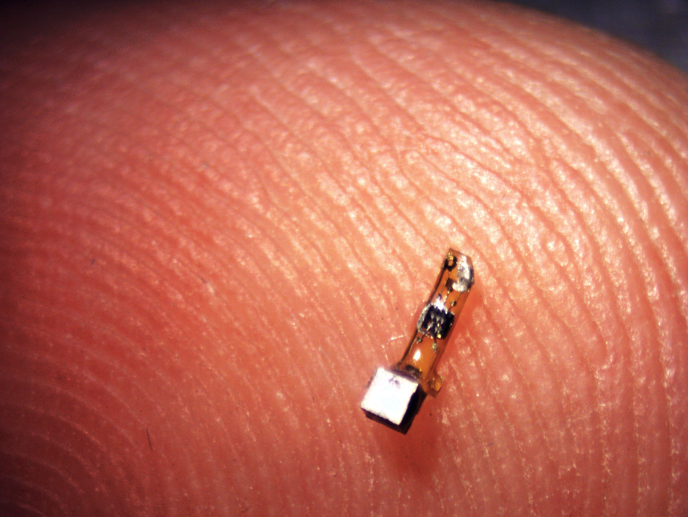
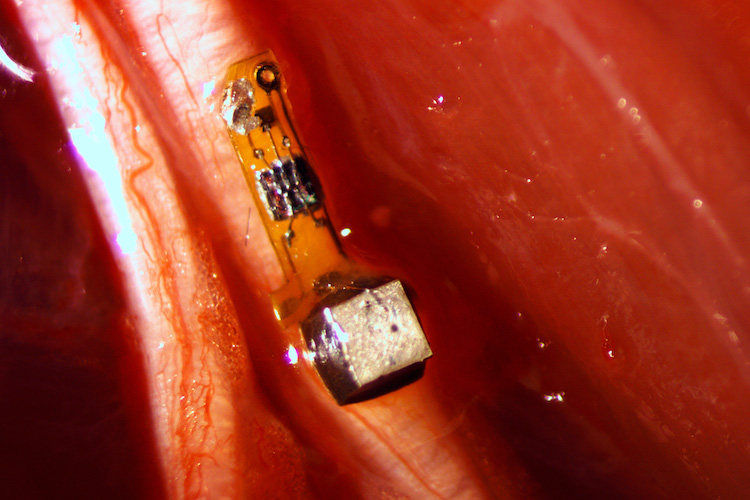
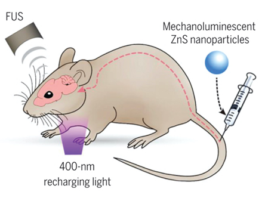

*This post reviews the significant milestones in the development of
neural dust and lays out the state of the art in 2020.*

<small class="caption">The neural dust device is 3 millimeters long and 1×1 millimeters in cross section. Picture: Ryan Neely, <a href="https://news.berkeley.edu/2016/08/03/sprinkling-of-neural-dust-opens-door-to-electroceuticals/UC"> UC Berkeley</a> </small>

The Sci-Fi Noir video series '[DUST](https://watchdust.com/)' imagines
the dystopic future of brain-computer interfaces. Science fiction novels
are replete with the idea of '*Neural Dust*', or nanoparticles
that float around in the brain to sense its activity in real-time. The
phrase 'neural dust' suggests a state where countless untethered
microscopic specks are sprinkled among neurons, collecting information
to put a bigger picture together.

As with most brain-computer interfaces, the technology that we currently
have is far behind the fiction. The goal that neural dust researchers
are currently pursuing — 10-100um free-floating sensors that detect
and report local extracellular electrophysiological data — is
relatively modest compared to the grand idea that the name evokes.

Scientists have indeed developed micron-scale devices that can read and
write from neurons. Some researchers have even gone as far as i*n vivo*
testing. But overall, this category of BCIs has received much less
attention than the fixed implantable devices or the wearable headgear.
In a recent
[podcast](https://paradromics.com/news/neurotech-pub-episode-1/) (Jump
to minute 50 of the to hear the discussion on neural dust), the CEO of
Paradromics dismissed the idea, suggesting that the delivery barriers
are insurmountable: "I'm not sure neural dust makes sense as a concept.
You're either delivering it like a gene gun — ballistically — or
you're sprinkling it on top, in which case it's no different from an
ECoG grid."

The following week, the pharma giant Astellas [announced that they were
acquiring](https://www.businesswire.com/news/home/20201014006060/en/)
neural dust startup Iota Biosciences for hundreds of millions of
dollars, doubling down on their earlier investment in the company.

[Iota Biosciences](https://iota.bio/), whose tagline is 'Vanishingly
Small Bioelectronics', holds an exclusive license to the
millimeter-sized bio-electronic device technology developed at the
University of California, Berkeley. Michel Maharbiz, and Jose Carmena,
who developed the technology through DARPA-funded research, founded the
company in 2017. Rather than build a single 'BCI' or neural interface,
the company's goal is to develop a customizable platform for research or
treatment of disease.

The researchers coined the term and explained it in a [2013
paper](https://arxiv.org/abs/1307.2196), and followed it up by
developing a
[prototype](https://www.sciencedirect.com/science/article/abs/pii/S0165027014002842)
designed to be free-floating and stay on the surface of the brain. The
group also validated that the technology [worked in
vivo](https://www.cell.com/neuron/fulltext/S0896-6273(16)30344-0#secsectitle0025).
Their technology consists of a millimeter-scale sensor coupled with an
ultrasonic backscatter system for powering and communicating with it,
demonstrated to work with spinal nerves rather than in the brain. At
1mm, the implant isn't yet 'vanishingly small', but the use of
ultrasound to power and communicate with the device was a game-changer.

<small class="caption">The neural dust device tethered to a spinal nerve. Picture: Ryan Neely, <a href="https://news.berkeley.edu/2016/08/03/sprinkling-of-neural-dust-opens-door-to-electroceuticals/UC"> UC Berkeley</a> </small>

Interestingly, the [first
author](https://scholar.google.com/citations?user=dc40_-AAAAAJ&hl=en) on
all these papers, [DJ
Seo](https://www.technologyreview.com/innovator/dongjin-seo/), is a
founding member of Neuralink, now heads implant systems at Neuralink.
[Neuralink](https://neuralink.com/), of course, is not working on neural
dust but on a coin-sized implantable device, electrode threads, and a
robot sowing machine.

In 2016, Rikki Muller and her research group developed an adaptation of
the neural dust motes called
'[StimDust](https://news.berkeley.edu/2018/04/10/berkeley-engineers-build-smallest-volume-most-efficient-wireless-nerve-stimulator/))'
that could also stimulate nerve fibers. They took the neural dust
platform and built a stimulator that can wrap around a nerve cuff to
stimulate it while also recording and transmitting the data. The key
[innovation](https://people.eecs.berkeley.edu/~rikky/Publications_files/Johnson_CICC_2018.pdf)
was a custom integrated circuit to transferred ultrasound charge to the
nerve in a well-controlled, safe, and efficient way.

Meanwhile, Arto Nurmikko at Brown University and Vincent Leung at the
[Qualcomm Institute Circuits
Lab](http://qi.ucsd.edu/research-services/circuits.php) at UC San Diego
are developing what they call "Neurograins". Neurograins are fully
wireless microscale implants that may be deployed to form a large-scale
network of untethered, distributed, bidirectional neural interfacing
nodes capable of active neural recording and electrical
microstimulation. They aim to create a "cortical intranet" of tens of
thousands of wireless micro-devices — each about the size of a grain
of table salt — that can be safely implanted onto or into the cerebral
cortex, the outer layer of the brain. The implants will operate
independently, interfacing with the brain at the level of a single
neuron. Charging and communication will be carried out through
radiofrequency waves. The effort was funded through DARPA's [Neural
Engineering System Design
(NESD)](http://www.darpa.mil/program/neural-engineering-system-design) program.
[An engineering
scheme](http://cwc.ucsd.edu/sites/cwc.ucsd.edu/files/5-08717023.pdf)
appears to be in place, but it isn't clear that the researchers have
tested the system extensively *in vivo.*

In 2019, a team of researchers at Stanford, led by Guosong Hong
developed a technique they called 'sono-optogenetics'. Although they
didn't use the term *neural dust*, their approach, explained in a paper
called '[Seeing the
sound](https://science.sciencemag.org/content/369/6504/638)' comes
closer to a neural dust vision than anything we have seen so far. The
[method](https://www.pnas.org/content/116/52/26332) they developed uses
circulating light-emitting nanoparticles to activate the motor cortex in
mice whose neurons are genetically modified to contain light-sensitive
receptors. These nanoparticles are 'mechanoluminiscent', meaning that
they transiently light up to activate the surrounding neurons. A
non-invasive ultrasound beam controls the nanoparticles, turning them on
and off with sub-millisecond precision. The 700um focus of this beam can
be anywhere, including deep within the brain. Changing the focus of the
ultrasound activates different neurons, provided that they have
light-sensitive photoreceptors. The other trick that the paper describes
is that the particles are rechargeable, or rather that they need
recharging. The charging occurs through an external light source when
the particles pass through blood vessels close to the surface of the
skin. The highly innovative system showed promising results in vivo and
is a testament to interdisciplinary knowledge. However, it is not likely
that optogenetics will be in humans in the near-term outside some select
applications for the retina.

<small class="caption">The sono-optogenetics system tested in rodents. Picture from  <a href="https://news.berkeley.edu/2016/08/03/sprinkling-of-neural-dust-opens-door-to-electroceuticals/UC"> Seeing the sound </a>, Guosong Hong, 2020 </small>

The Astellas acquisition of Iota is promising and means that the
[electroceutical](https://www.darpa.mil/program/electrical-prescriptions)
technology is likely to enter human trials and move towards regulatory
clearance. But it's not clear that there are any startups or even
academic research labs still working on the neural dust approach. The
handful of technologies described above appear to have just touched the
surface of the concept, with many barriers that exist before the
technology is widely applicable. Size, scalability, and most important
— delivery mechanisms — appear unsolved, at least until optogenetic
techniques become widely feasible in humans.
