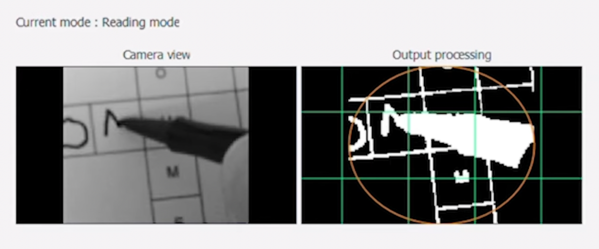
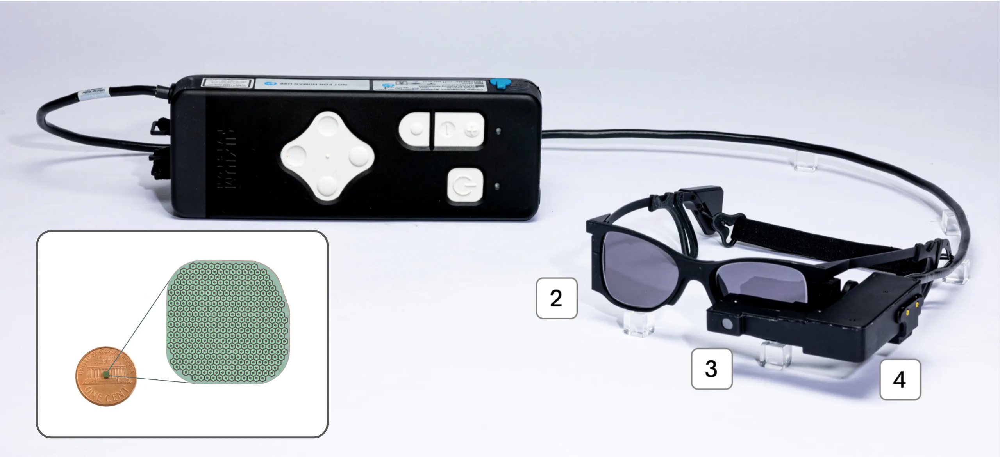
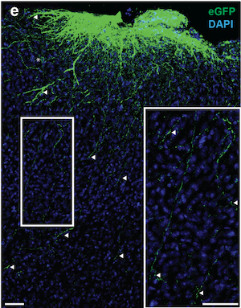
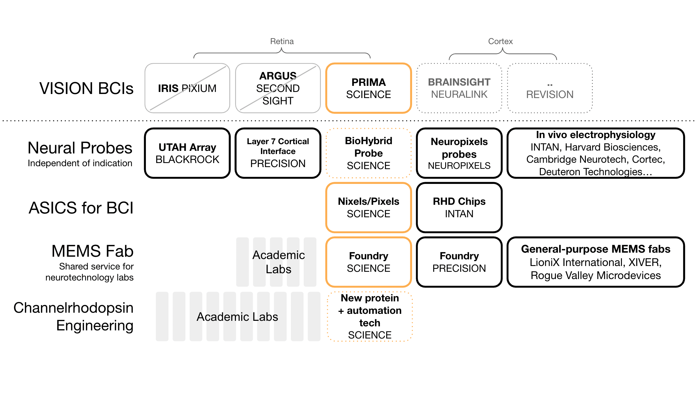

*The success of the PRIMA implant in clinical trials makes Science Corp the leader in vision BCIs. The company is also simultaneously pushing research and engineering forward along several other fronts, all while staying focused on retinal prostheses. This post tracks Science Corp’s progress since it was founded in 2021 by Max Hodak and other ex-Neuralink engineers.*

## Success of the PRIMA implant clinical trial

The positive results from the pivotal clinical trial of the PRIMA implant [were recently published](https://www.nejm.org/doi/full/10.1056/NEJMoa2501396) in New England Journal of Medicine, showing that the implant restored vision in patients with age-related macular degeneration. Importantly, this is the first vision prosthesis to provide patients with ‘form vision’ that allows them to recognize letters and read. Previous attempts at vision neural interfaces showed that the brain could be stimulated, but in response to visual stimuli patients would see ‘phosphenes’ or flashes of lights that were not correlated to the shape or form of the objects that they intended to see. The 2X2 mm, 378-pixel PRIMA implant also has the advantage of being wireless and powered through the same laser light that stimulates it. 

<small class="caption">Still from an <a href="https://www.youtube.com/watch?v=5XQOgCn2WDs">video with results of the PRIMAVERA clinical trial</a> showing a patient filling out a crossword puzzle using the implant.</small>

Science Corp acquired the PRIMA system in April 2024 for [€4 million](https://www.technologyreview.com/2025/10/20/1126065/this-retina-implant-lets-people-with-vision-loss-do-a-crossword-puzzle/) along with other assets and staff from the French company Pixium. Pixium in turn had licensed the technology in 2013, originally [patented by Daniel Palanker and team at Stanford in 2004](https://patents.google.com/patent/EP1670544A4/en). In all, that makes over 20 years of development cycle from the lab to being used in patients — a cycle that the Science team and other BCI companies will hope to shorten for future devices. 

<small class="caption">The 2mmX2mm 379-pixel retinal implant and the glasses with the camera-infrared projector and camera. From the <a href="https://science.xyz/technologies/prima/">Science Corp website</a>.</small>

## The Science Eye and the biohybrid implant

Science Corp’s first announcement was the ‘Science Eye’, a supra-retinal implant that delivered stimulation to the optogenetically modified retinal ganglion cells (RGCs) through a micro-LED display panel. The chip had an extremely high resolution for stimulation compared to the PRIMA, but the RGCs are further downstream (towards the brain) than the bipolar cells that the PRIMA system targets, and it hasn’t been shown that stimulating the RGCs can lead to ‘form vision’. Crucially, optogenetic modification has never been done in the human brain cells, so this implant would have been decades away from clinical use, for safety reasons. So it’s not surprising that they chose to prioritize PRIMA which is much closer to clinical trials and human use. 

<small class="caption"> Microscopy image showing axons (green) from the implant deep into the cortex(blue nuclei). Image from the <a href="https://www.biorxiv.org/content/10.1101/2024.11.22.624907v1.full.pdf">preprint paper</a>.</small>

However, the company is still betting on optogenetics through their work on the biohybrid implant. In a [2024 preprint](https://www.biorxiv.org/content/10.1101/2024.11.22.624907v1) describing their research on the biohybrid probe, they proved the concept that neurons grown outside the body could be made to communicate with brain cells. The study allowed the team to conclude that mice implanted with a biohybrid implant were able to respond to the optical stimulation of the implanted neurons. Although the study had several caveats — the change in behavior in the mice was not statistically significant; the optical stimulation was extremely strong; and there was no recording of activity originating from inside the brain indicating a 2-way interface — the concept is promising and is likely to make its way to humans before technology that requires directly modifying human brain cells to respond to light.  
The neuron-chip interface in this biohybrid implant device is outside the brain with axons growing out to form synapses with existing neurons in the brain. Recording and stimulation takes place outside the brain and can be observed and measured and controlled better, with much less damage to brain tissue, which should enable a much higher bandwidth and a longer lasting implant. This is not a new idea, so it's surprising that none of the other established implantable BCI companies have gone this route yet.

## Automated channelrhodopsin engineering

Science Corp’s [newest preprint](https://www.biorxiv.org/content/10.1101/2025.09.12.675947v1) describes work that is even further upstream in the BCI R&D pipeline. The key innovation was to automate and scale up the development of new channelrhodopsin variants. Channelrhodopsins are the proteins that make neurons sensitive to light so that they can be stimulated as part of a neural interface. Science Corp’s team developed an automated high-throughput screening method that they could use to select channelrhodopsin variants with promising properties. In this case they selected one that was sensitive to low levels of light — a property that could feed into future versions of their implants and can perhaps be commercialised independently. 
The automated protein engineering technology that allowed them to run this screen is equally valuable as an asset, and could potentially be developed into a product for other researchers, or run as a service for the same set of customers that use their MEMS fabrication service.

## MEMS fabrication and readymade ASICs
Science Corp’s ‘foundry’ is a MEMS fabrication facility, offering researchers to outsource the fabrication of semi-custom chips that they can use to run experiments. MEMS stands for micro-electro-mechanical systems. These are the chips needed for research and development of almost any kind of implantable neural interface. Setting up a MEMS facility is extremely capital-intensive and it requires specially trained staff. Science Corp acquired a MEMS Facility in 2022, and has since been running it as a commercial shared service for like-minded labs both in academia and industry. While they likely use a fraction of its capacity for their own projects, allowing customers to share the costs accelerates innovation in the space. [Precision Neuroscience](https://precisionneuro.io/foundry) is another BCI company that has a foundry and offers MEMS development, with a similar business model.  

Finally, the startup has some off-the-shelf products for labs that work in similar areas. These include programmable ASICs for optical stimulation and electric recording, a headstage, and a software toolkit that works with their system. 

## The Science Corp portfolio

<small class="caption">Science Corp’s portfolio of assets.</small>

The company describes itself as being ‘fully vertically integrated’. An alternate way to phrase it is that Science Corp has a portfolio of investments in BCIs and BCI-adjacent neuroscience research at various stages in the pipeline. Their position is unique, and hard to compare their trajectory to the more established neurotech companies because each of their bets has a slightly different business model and a vastly varying time horizon to maturity. The programmable ASICs, the high-throughput channelrhodopsin screen and the new WiChR F240A channelrhodopsin are assets that they could commercialize early via neuroscience labs and startups, while also using the technology to accelerate their implants. The biohybrid probe is a very early prototype and it will likely be a decade or more before this comes to human trials.

Since being founded in 2021, the company  has raised $290MM in total, with the last $100M being from a funding round in early 2025 on the back of the positive results on the PRIMA pivotal clinical trial.  Science Corp is responsible for bringing the PRIMA device to patients in the EU, now that the pivotal trial was successful, while attempting to get approval for it through the US FDA. If that works out, the product could potentially generate enough revenue (or attract even more funding) to see their longer-term bets through to fruition.
