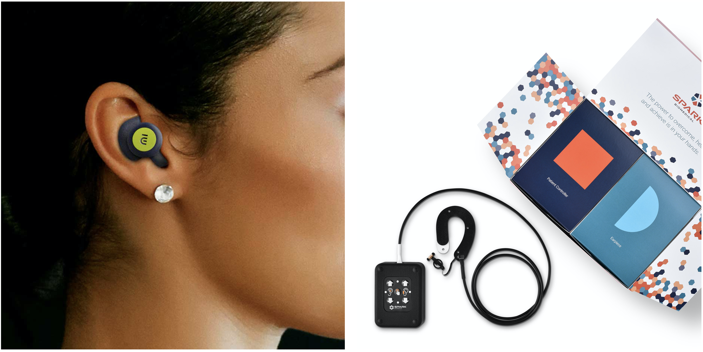
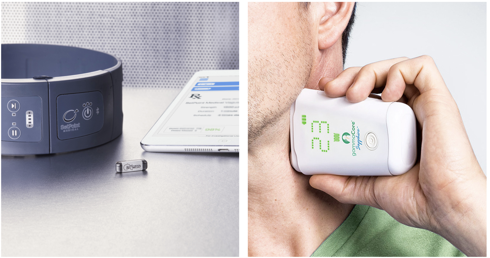
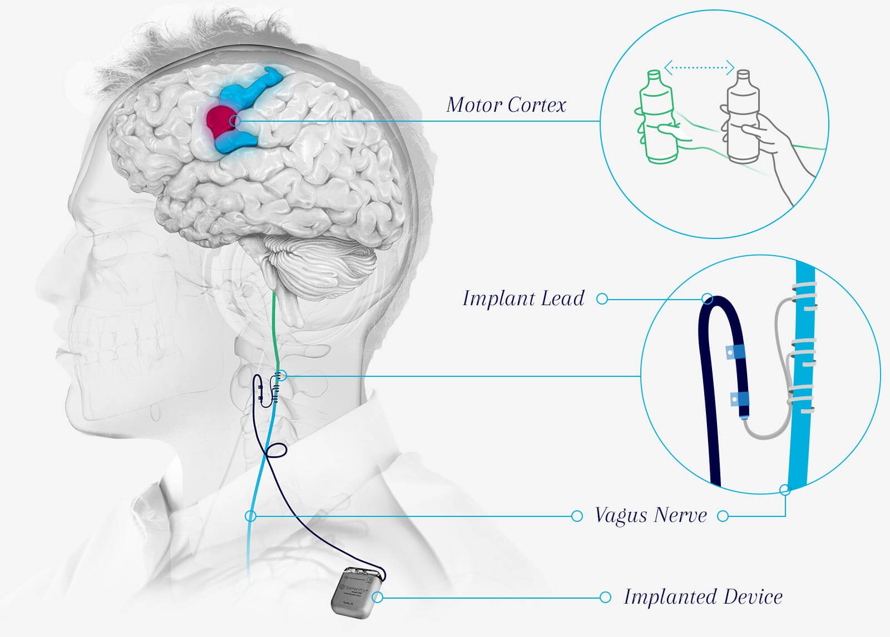

*Electrical stimulation of the Vagus nerve to treat chronic disease has
been around for 35 years, with mixed success. Fifteen ventures, as many
therapeutic areas, and billions of dollars later, a new wave of
breakthrough devices targeting areas like auto-immune diseases and
diabetes is emerging. This post expands on a recent [STAT
article](https://www.statnews.com/2021/04/22/vagus-nerve-stimulation-electrocore-spark/)
about companies in the field, looking deeper into the history and
further into the future of vagal nerve stimulation devices.*

Vagal nerve stimulation (VNS) therapies promise a revolutionary
alternative to pharmaceutical treatment for chronic diseases. By
electrically stimulating the Vagus nerve, wearable or implanted devices
could modulate the activity of the brain and other organs more
precisely, conveniently, and with fewer side effects than drugs.

The field has come a long way since the first commercial venture
(Cyberonics) was founded in 1987 to develop an implantable vagal nerve
stimulator for epilepsy. The [Feinstein
Institute,](https://feinstein.northwell.edu/institutes-researchers/bioelectronic-medicine)
[DARPA](https://www.darpa.mil/program/electrical-prescriptions), and the
pharmaceutical giant
[GSK](https://www.gsk.com/en-gb/media/press-releases/gsk-and-verily-to-establish-galvani-bioelectronics-a-new-company-dedicated-to-the-development-of-bioelectronic-medicines/)
have all made significant R&D investments in bioelectronic medicine.
There have been more than a dozen spinoffs from these R&D efforts, but
few have had made it past the clinical stage.

As of 2021, only four Vagus nerve devices have made it to market.
Patients can only access them in situations where drugs do not work
(refractory epilepsy or treatment-resistant depression for example).
Payers have been late to the party and have sometimes withdrawn coverage
after initially offering it, meaning that health insurance often does
not pay for treatment.

This hasn't deterred new entrants, like Nēsos, Spark, or GSK's venture
Galvani Bioelectronics, all set up after 2016. They have uncovered
lucrative new therapeutic areas and devised more precise ways of
stimulating the system. While the early ventures focused on
cardiovascular illnesses, depression, and epilepsy, the newer players
have their sights set on diabetes or autoimmune diseases like rheumatoid
arthritis.

Strictly speaking, not all the companies featured in this post target
the Vagus nerve; some target the sympathetic side of the system, or its
naturally occurring sensors. CVRx, for example, modulates the autonomic
nervous system by stimulating the carotid body. Galvani is working on
other autonomic nerves in addition to the Vagus, often choosing to
modulate sympathetic nerves closer to their target organ.

<iframe title="Vagus Neuromodulation Ventures" aria-label="chart" id="datawrapper-chart-yy1Fm" src="https://datawrapper.dwcdn.net/yy1Fm/1/" scrolling="no" frameborder="0" style="width: 0; min-width: 100% !important; border: none;" height="600"></iframe>

The Science
===========

The autonomic nervous system (ANS), which flips the body between the
'fight or flight' and 'rest and digest' states connects to all the major
organs and modulates their function through electrical impulses. This
twinned system regulates all biological functions: Breathing, heart
rate, blood pressure, food intake, metabolism, and even immunity.

The Vagus nerve is the single long nerve that makes up the 'rest and
digest' arm and connects with nearly every organ. But it isn't just a
straightforward conduit that transmits information top-down from the
brain to the organs. It is a bi-directional information superhighway,
that also picks up signals from organs and from receptors that monitor
the blood for chemical signals and passes them to the brain in a
feedback loop. The 'fight or flight' arm of the autonomic nervous system
is organized differently, with a chain of nerve nodes along the spinal
cord leading to a dedicated nerve for each organ.

This makes the autonomic nervous system a natural target for many
chronic diseases. If a device stimulates the appropriate fibers of the
Vagus nerve in the correct location, it can selectively influence
afferent (towards the brain) or efferent (towards the organs) signaling.
A device placed at the neck or the ear, stimulating for a few minutes
every day could influence metabolism or immunity to treat a host of
conditions.

Vagus nerve and ANS ventures (1987 to 2021)
===========================================

The New Wave
------------

'New' is relative in the VNS world. Timelines from startup to FDA
clearance can easily stretch to a decade or even two.

### Spark

Founded in 2018, [Spark Biomedical](https://www.sparkbiomedical.com/)
develops wearable neuromodulation devices that treat opioid withdrawal.
The device wraps around the ear with a little earplug attachment that
allows it to simultaneously stimulate the vagus nerve in the ear and the
trigeminal nerve in front of the ear.

In a [series of
events](https://podcasts.apple.com/us/podcast/s2-e13-tackling-other-pandemic-opioid-use-withdrawal/id1528214231?i=1000516049179)
that can only be described as fortune favoring the brave, the Spark team
managed to get the right clinicians on board, find a suitable clinical
trial site, secure funding for their first [neonatal
study](https://www.frontiersin.org/articles/10.3389/fnhum.2021.648556/full),
and receive breakthrough device status for this population in record
time. They received their first FDA clearance for their use in adults in
January 2021 and are now working towards approval to treat opioid
withdrawal in newborns. Reimbursement or insurance coverage for their
therapy is still a few years away, and the adult device is currently
available on a self-pay or charitable use basis.

Although there is no public information about the company's funding
aside from an [SBIR
grant](https://www.prnewswire.com/news-releases/spark-biomedical-receives-217k-nih-grant-to-help-opioid-addicted-newborns-300940957.html),
the team should be able to garner substantial investor interest given
their rapid achievement of milestones and the huge unmet need for the
product due to the ongoing US opioid crisis.

The idea of stimulating the Vagus nerve at the ear is not new.
[Cerbomed](http://www.implantable-device.com/category/aimd-companies/cerbomed/)
received approval in Europe (CE marking) for the treatment of epilepsy,
depression, and pain through a patient-controlled earpiece-mounted vagal
nerve stimulator in 2012, but the company has since fallen off the VNS
map.

<small class="caption">The Nēsos (left) and Spark (right) devices that stimulate the vagus nerve at the ear. Images from the <a href="https://nesos.com/"> Nēsos</a> and <a href="https://www.sparkbiomedical.com/"> Spark</a> websites.</small>

### Nēsos

[Nēsos](https://nesos.com/), founded in 2016, is the brainchild of Nevro
founder Konstantinos Alataris. With \$16M in funding so far, the company
received breakthrough device status from FDA for their earbud-like
non-invasive vagal nerve stimulator. The device is used to provide
'e-mmunotherapy' and worn for a few minutes every day.

The company completed a pilot study for rheumatoid arthritis, an
auto-immune disease that is currently treated with expensive biologic
drugs and is moving on to pivotal trials. Migraine and depressive
disorders could be next in the pipeline, along with a new fundraise.

Some of the early team is ex-Nevro, a company that went from founding to
IPO in 8 short years, successfully competing with the giants of the
spinal cord stimulation industry. A non-invasive device, combined with a
commercially attractive launching indication and the founder's track
record in the industry will likely take this start-up far.

### Galvani Bioelectronics

[Galvani](https://galvani.bio/) is the pharmaceutical major GSK's
high-profile bet on bioelectronic medicine. Founded in 2016, through a
£540M partnership with Alphabet's Verily, Galvani has a much larger
mandate than the typical VNS startup. Their focus appears to be less on
the Vagus nerve, and more on the sympathetic arm of the ANS, which
allows activation of multiple neuromodulation approaches for diseases
like diabetes. The company has not yet announced a launching indication
or therapeutic area but is probably well into their [pilot human
trials](https://clinicaltrials.gov/ct2/show/NCT04171011), targeting
nerves to the spleen to treat inflammatory or auto-immune disease.

Galvani has taken a pharma-style pipeline approach to neuromodulation.
They start with investment in R&D, incubating in-house research groups.
Approaches that show promise on pre-clinical trials are moved forward to
pilot clinical testing and then on to pivotal trials and FDA approval.
Galvani has also formed numerous external research collaborations. Their
parent GSK has a bioelectronics venture arm called '[Action Potential
Ventures'](https://www.actionpotentialvc.com/). Verily was originally
intended to provide some of the cutting-edge electronics capabilities
for the nerve interfaces, but Galvani has also licensed devices from
Nuviant medial and Enteromedics.

Other than the recent news about the [firing of
chairman](https://www.biospace.com/article/gsk-terminates-moncef-slaoui-as-chairman-of-galvani-bioelectronics-following-sexual-harassment-charges/)
Moncef Slaoui, Galvani has kept a low profile since its launch in 2016.
This company may well be one to watch, given its lineage and funding.

### BIOS

BIOS positions itself as a software platform rather than a
neuromodulation startup. Founded in 2015, with \$5.6M in funding so far,
the team has built a machine learning platform off weeks of data
collected from [vagal nerve cuff electrodes in
swine](-%09https:/www.crowdcast.io/e/swc-symposium-2020/3). While
working on [characterizing this
data](https://openreview.net/pdf?id=SJxoX7K8LS) to discover biomarkers
for chronic cardiac or respiratory disease, their larger goal is to
provide a read-write interface to the Vagus nerve and the sympathetic
chains around the spine so that pharma or other medical devices can
discover biomarkers or implement closed-loop neuromodulation. All steps
involve a heavy dose of machine learning magic.

BIOS' current team is short on both clinical expertise and industry
experience and will likely be taken more seriously once they pass a
regulatory milestone or make it to a clinical study.

The Old Guard
-------------

Companies founded in the 2000s are now making waves in ANS
neuromodulation.

### Setpoint

10 years older than Nēsos, [Setpoint
Medical](https://setpointmedical.com/) is also going after the same
disease -- rheumatoid arthritis. They also recently (October 2020)
received a breakthrough device designation and are now in trials.
Setpoint's device is a pill-sized, wireless, remotely rechargeable
stimulator implanted near the carotid artery in the neck. The company
also has a renowned co-founder in Kevin Tracey. Tracey's research group
at the Feinstein Institute pioneered the science of controlling the
immune system through the Vagus nerve.

Having raised \$216M to date, Setpoint appears well-funded, but the
costs and timelines of clinical testing for an implanted device are much
higher than a non-invasive device. Once they get approved by FDA, they
will still need to convince payers to shell out [\$30,000 plus the cost
of
surgery](https://www.evaluate.com/vantage/articles/interviews/interview-setpoint-good-start-clinic).
On balance, this is still far more cost-effective than the expensive
biologic drugs currently used to treat the disease. When biosimilars or
'generic' versions of the biologics become available in the US in 2023,
this pricing may be harder to justify, especially if the device is only
approved for treatment alongside drugs.

They are aiming for multiple inflammatory disorders, an enormous
potential market. Setpoint's website indicates that '*Rheumatoid
arthritis, inflammatory bowel disease, psoriasis, multiple sclerosis and
heart disease all share a common cause: Inflammation.*' To realize this
value, Setpoint will have to demonstrate that their implanted devices
perform significantly better in trials than their non-invasive
counterparts.

<small class="caption">The Setpoint implantable wireless stimulator (left) and Electrocore's non-invasive Gammacore device (right). Images from the <a href="https://setpointmedical.com/"> Setpoint Medical</a> and <a href="https://https://www.electrocore.com/"> Electrocore</a> websites.</small>

### Electrocore

[Electrocore](https://www.electrocore.com/), founded in 2005, received
FDA approvals in rapid succession from 2017 through 2021 for their
non-invasive vagal nerve stimulator to treat and prevent migraine and
cluster headache. They have also achieved significant reimbursement
milestones in the US and are making headway in the UK, meaning that
their therapy is often reimbursed by insurers. The company's website is
transparent about its pipeline, which includes several neurological and
gastrointestinal disorders.

When applied to the neck for a few minutes each day, the device
purportedly stimulates the Vagus nerve at the carotid in an afferent
direction — meaning that it influences signals going towards the brain.
Skeptics question whether the device affects the Vagus nerve at all, or
has an alternative mechanism of action, as clinical trials have not
shown that the stimulation produces the side effects commonly associated
with implanted VNS devices.

Still, Electrocore is one of only two vagal nerve stimulation companies
to have made it this far. The other is Livanova. Both companies are
publicly traded, and Electrocore is a fair distance from profitability,
with net annual sales at around \$3.5M.

### MicroTransponder

Founded in 2007, [MicroTransponder](https://microtransponder.com/en)
recently announced the positive clinical trial results for its 'paired
VNS' therapy for stroke rehabilitation. The device is an implanted vagal
nerve stimulator that is activated during rehabilitation therapy to
improve recovery of motor functions.

As part of ongoing clinical trials, the Dallas-based company pairs the
same device with headphones for the treatment of Tinnitus. Neither
therapy is approved by the FDA yet, and the long interval between
development and commercialization means that the design of the cuff
electrode with the implantable pulse generator could be outdated by the
time the device comes to market.

<small class="caption">Microtransponder's implantable VNS system in trials for stroke rehabilitation. Image from the <a href="https://microtransponder.com/en"> Microtransponder</a> website.</small>

### LivaNova

The oldest name in VNS, [Livanova](https://www.livanova.com/en-US/), was
formed when Cyberonics (founded in 1987) merged with Sorin. Their
implantable vagal nerve stimulator received FDA approval for the
treatment of refractory epilepsy in 1997 and treatment-resistant
depression in 2005. The US Centers for Medicaid and Medicare initially
announced that would pay for the therapy in patients but then reversed
their decision in a blow to the company and industry. 15 years later,
the team hasn't given up on depression, and CMS finally agreed to
[reimburse the
therapy](https://investor.livanova.com/news-releases/news-release-details/livanova-receives-approval-us-centers-medicare-medicaid-services)
in 2019. They recently [kicked
off](https://www.fiercebiotech.com/medtech/verily-livanova-kick-off-study-to-monitor-effects-nerve-stimulation-for-treatment-resistant)
a large (1000 patients, 100 hospitals) study with Verily life sciences
for vagal nerve stimulation for treatment-resistant depression.
Alphabet's connection is that 300 of these patients in a sub-study will
use Verily's wearable device to monitor physiological parameters like
sleep, breathing, and heart rate, and a 'Mood app' to record depressive
episodes.

Meanwhile, the company's epilepsy neuromodulation business has done
well, and the company is expected to be profitable next year, with Wall
Street analysts talking of a ['turnaround
story'](https://seekingalpha.com/article/4423745-living-la-livanova-shakeup-pays-in-capital-gains).
After a [scathing
letter](https://www.primestonecapital.com/files/LIVN%20Letter%20PrimeStone%202020-10-12.pdf)
from shareholders in October 2020, Livanova will probably move faster to
shed the cardiovascular business that it inherited from Sorin, and focus
more squarely on neuromodulation.

### CVRx

[CVRx](https://www.cvrx.com/), another prominent name in ANS
neuromodulation, markets a 'Barostimulation' device that does not
directly modulate the vagus nerve or any nerve at all. It stimulates
baroreceptors in the wall of the carotid artery, which in turn restores
autonomic balance, reducing blood pressure and ameliorating the symptoms
of systolic heart failure.

Founded in 2001, the company has an interesting
[backstory](https://podcasts.google.com/feed/aHR0cDovL21lZHNpZGVyLmxpYnN5bi5jb20vcnNz/episode/QnV6enNwcm91dC04MDc2NDMw?hl=en-NL&ved=2ahUKEwjk58eUgvnwAhXQ16QKHSFCAwsQjrkEegQIBBAF&ep=6).
It pivoted from hypertension to cardiac failure in 2006 and then went on
to innovate by working with FDA through a unique clinical trial design;
finally achieving breakthrough device status, FDA approval, and
reimbursement twenty years after it was set up.

### PINS Medical

[Beijing PINS Medical](http://pinsmedical.com/)'s VNS device has been
approved for the treatment of refractory epilepsy in China sine 2016.
The company markets a vagal nerve cuff electrode with an implantable
pulse generator. As of 2019, the device was used by nearly [300
patients](https://www.ncbi.nlm.nih.gov/pmc/articles/PMC6332620/) in 60
hospitals.

The Ghosts
----------

VNS devices have not made it to the market in some key therapeutic
areas.

### BioControl

Israel-based Biocontrol Medical developed the Cardiofit vagal nerve
stimulator to treat cardiac failure. Pre-clinical and early clinical
trials were encouraging but the company's 700-patient pivotal clinical
trial failed to show that the treatment worked as intended. The company
shuttered in 2016, following the failure of its famous INNOVATE-HF
trial. Companies like CVRx used the learnings from INNOVATE-HF and
Boston Scientific's parallel NECTAR-HF trial to select patients more
carefully for their clinical studies.

### Transneuronix

Founded in 1995, Transneuronix had developed a 'gastric pacing' device,
whose mechanisms of action might have included VNS. The company was
acquired by Medtronic in 2005 for USD 260 MM before it completed its
pivotal trial in the US. It's not clear if the trial succeeded or if
Medtronic is marketing the device or modifying it for other indications.

### Enteromedics

Like Transneuronix, Enteromedics had a stomach pacemaker called vBloc,
which claimed to treat obesity by blocking conduction in the vagus nerve
around the stomach. In 2015 the device received FDA approval for weight
reduction, despite mixed performance in clinical trials. IN 2017, a
[cost-effectiveness
study](http://www.ajmc.com/journals/issue/2017/2017-vol23-n8/Cost-Effectiveness-Analysis-of-Vagal-Nerve-Blocking-for-Morbid-Obesity.)
of vBloc therapy for obesity showed that the therapy was likely to be
good value for money in certain subsets of individuals. But there was no
clear path to national reimbursement coverage and switched to 'prior
authorization' to get patients to pay for one-off use.

Recent [research](https://pubmed.ncbi.nlm.nih.gov/28361793/) casts doubt
on the mechanism of action of the vBloc device, indicating that it may
work through mechanisms other than VNS. In 2017, the company changed its
name to Reshape, pivoting to '*a full-scale provider of medical devices
to address the continuum of care for obesity and its associated health
conditions*' meaning that the company offers multiple obesity-related
solutions unrelated to neuromodulation.

Despite the failures, vagal nerve stimulation seems to be picking up
pace again, with new research directions and therapeutic areas.
Researchers are currently focused on finding ways to [stimulate the
nerve more precisely,](https://pubmed.ncbi.nlm.nih.gov/32513973)
targeting well-defined nerve fiber subtypes. The expansion of VNS into
areas lie auto-immune diseases, opioid addiction, and diabetes means
that neuromodulation could eventually gain a foothold in some of Big
Pharma's biggest markets. If device-makers can convince payers that the
technology is cost-effective, this might be the decade when VNS finally
takes off.
