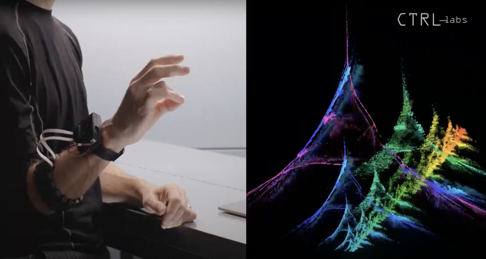
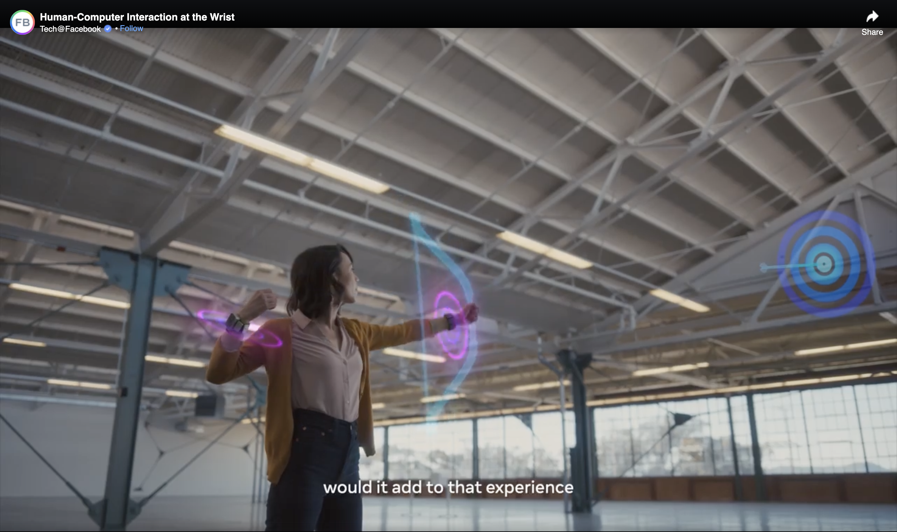
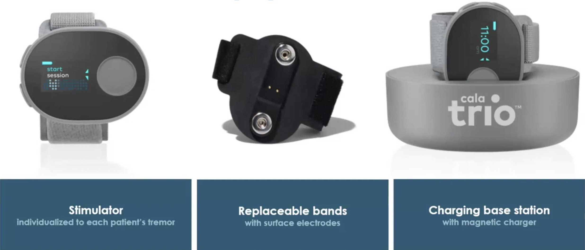

*Neural interfaces may be mainstream before we know it, in very familiar
form. Facebook's Reality Labs division is working on a consumer device
that senses tiny nerve signals at the wrist to offer unheard-of degrees
of hand control. Cala Health has taken wrist interface technology
into medical device territory. Their prescription-only wristband for
individuals with movement disorders influences the brain's tremor
network by stimulating nerves at the wrist. This blog post explores how
these devices sense and stimulate nerve fibers at the wrist to create
new pathways to and from the brain.*

Futuristic devices that read signals directly from neurons in the brain
have captured media and investor interest, based on the premise that we
could one day communicate with computers at much higher speeds. The
promise (or the threat, depending on your point of view) is that this
'neural lace' will allow us to mesh more closely with machines, to have
them read our thoughts (and maybe write them!?) so that we can transcend
our human limitations.

The technology that ushers in this sci-fi future will probably be much
more prosaic — and safer — than Neuralink's invasive
electrodes or even Kernel's TD-fNIRS helmets. Facebook's 2019
acquisition of [CTRL-Labs](https://www.theverge.com/2019/9/23/20881032/facebook-ctrl-labs-acquisition-neural-interface-armband-ar-vr-deal) and their continued investment in the
wrist-worn nerve sensor technology mean that the first directly sensed
consumer neurons will be those that innervate the forearm and hand.

## Sensing from wrist nerve fibers just underneath the skin

The name EMG or electromyography sounds like it means electrical signals
from the muscles — but what the sensors really pick up are action
potentials from individual motor neurons that innervate these muscles.
These signals are amplified and converted to detectable waveforms by the
muscle fibers before the muscle contraction occurs. The sensors on the
wristband pick up the intent to move, rather than the motion itself.
This allows the user to have new dimensions of control and creates a
faster, higher-bandwidth connection with the environment than our
natural hands.

The wrist is the perfect candidate for a consumer neural interface
because it allows for non-invasive access to nerve fibers running just
beneath the skin. Wrist EMG is physically comfortable, and the form
factor is familiar. More importantly, it's reassuring that these devices
can't really tap into your thoughts but can only intercept the
volitional control of your muscles.

# Facebook/CTRL-Labs' Wristband gives EMG an upgrade

<small class="caption">Demo of CTRL-Labs' technology before they were acquired by Facebook.</small>

Founded in 2015 by internet pioneer-turned neuroscientist Thomas Reardon
with two more neuroscientists Patrick Kaifosh and Tim Machado, CTRL-Labs
was distinct from brain-computer interface startups because the team set
out to make a consumer device, a daily-use interface to the computing
world. They started to "[build devices that allowed them to listen
directly to the neurons that are otherwise controlling
muscles](-https:/www.youtube.com/watch?v=Iuhrs8UbDRQ)".

By 2019, when Facebook acquired the startup, CTRL-Labs had developed a
wristband prototype that could [guide a six-legged robot
spider](https://www.youtube.com/watch?v=YmkZKiJh95g), touch-type,
control a wide range of on-screen movements, and more. Since the
acquisition, the team has continued to build on its foundational
research. Their work on [decomposing signals into their constituent
motor units](https://youtu.be/Q559ycoBkeE?t=1390), motor unit
recruitment, and adaptive learning is taking the EMG field in a very
impactful direction. As part of Facebook's 'Reality Labs' division
alongside AR/VR, they appear to be leaning hard into interfaces to the
virtual world, including a wrist haptic feedback prototype, that allows
the user to feel growing resistance while drawing a virtual bowstring.

It appears that Facebook is committed to the wristband tech for the long
term, with VP Andrew Bosworth speaking of this technology as an
investment with a 5-10-year horizon. Earlier this year, Facebook
[divested](https://www.technologyreview.com/2021/07/14/1028447/facebook-brain-reading-interface-stops-funding/)
its other BCI projects, such as the [implanted speech
neuroprosthesis](https://tech.fb.com/bci-milestone-new-research-from-ucsf-with-support-from-facebook-shows-the-potential-of-brain-computer-interfaces-for-restoring-speech-communication/)
collaboration with UCSF scientists.

<small class="caption">A screenshot from Facebook's wrist haptic technology <a href="https://www.facebook.com/watch/?v=1146186389155473">demo</a>.</small>

# Cala Health's Cala Trio stimulates nerves at the wrist to impact the brain

The other path-breaking wristband interface — [Cala
Health's](https://calahealth.com/) Cala Trio device — has little in
common with CTRL-Labs', apart from their investors. Both companies
received investment from Lux Capital and GV (Google Ventures). The Cala
Trio does not use EMG sensors, is a medical device rather than a
consumer gadget, and is already on the market as a prescription device.

Cala Health is the poster child for bioelectronic medicine, a class of
therapies that aims to treat chronic diseases by electrically
stimulating nerves. Also called 'neuromodulation', this rapidly growing
branch of medicine is developing devices that stimulate various nerves
to treat cardiovascular, metabolic, or neurological conditions without
the side effects that pharmaceuticals often cause.

The primary indication for the device is essential tremor — a kind of
arm tremor that affects 7 million patients in the US. In the company's
words "Cala Trio gently stimulates the nerves in the wrist to disrupt
the tremulous activity in the brain, without the need for invasive brain
surgery or medication". Founder and CSO Kate Rosenbluth and CEO Renee
Ryan have led the company through a [large clinical
trial](https://calatrio.com/healthcare-professionals/clinical-evidence/),
tracking therapeutic efficacy for months as patients wore the devices at
home.

<small class="caption">Cala Health's Cala Trio wristband. Screenshot from a company <a href="https://youtu.be/HQXPtbt3FzE?t=388">video</a>.</small>

The device is one of the first successful peripheral neuromodulation
therapies to come to market. Its presumed mechanism of action is that it
stimulates nerves at the wrist to target the ventral intermediate
nucleus in the brain. This turns the median and radial nerves into a
non-invasive interface to the brain's tremor network. Unlike typical
prescription medical devices, the Cala Trio is patient-centered, meaning
that it is shipped directly to the patient's home once prescribed, and
the patient is in full control of the therapy. The wristband also
contains onboard accelerometers that allow it to track the motion of
the arm and hand in 3D. This data is returned to Cala Health while the
device is charging, and the company can use it to monitor the efficacy
of the therapy and improve it further.

The company and recently received FDA's [breakthrough
designation](https://www.businesswire.com/news/home/20201022005276/en/Cala-Health-Receives-FDA-Breakthrough-Device-Designation-for-Cala-Trio%E2%84%A2-Therapy-to-Treat-Action-Tremors-in-Parkinsons-Disease)
for Parkinson's disease tremor, signaling an easier path to
reimbursement in the US market. Cala Health's last fundraise was a
\$50MM Series C round in 2019. The team is pushing forward to
deliver more neuromodulation therapies for neurological, psychiatric,
and cardiovascular conditions — perhaps by stimulating nerves through a
wearable device at the ear.

The two devices come from different worlds and have vastly different
target users, but both point to the wrist as being the gateway to the
brain. Whether it's sensing the intention to move as in the case of
Facebook's still-unnamed wristband or stimulating peripheral nerves to
affect central nervous system networks in the case of Cala Health,
non-invasive access to nerves at the wrist opens up a world of
possibilities.

*Medical device development is chronically underfunded. As a result, the
underlying technology is frequently outdated when it comes to
market, and the devices themselves are not always user-friendly.
Facebook's investment in accessible, consumer-focused neural interfaces
(and the R&D behind them) may well be the catalyst this space
needs.*
